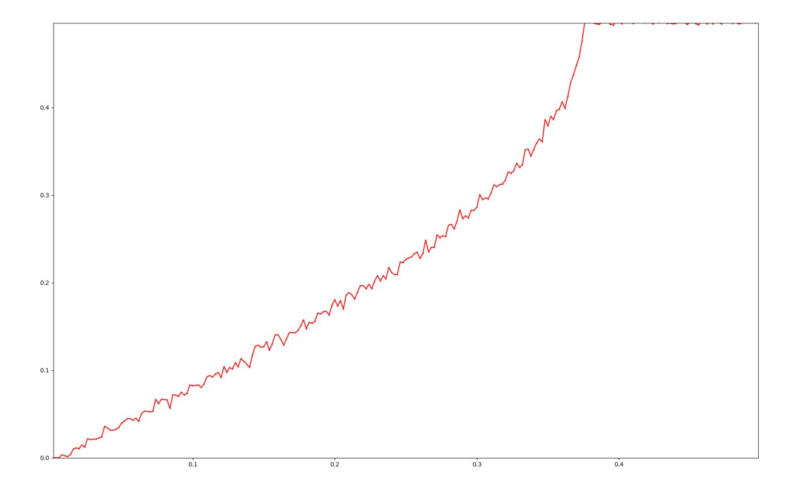
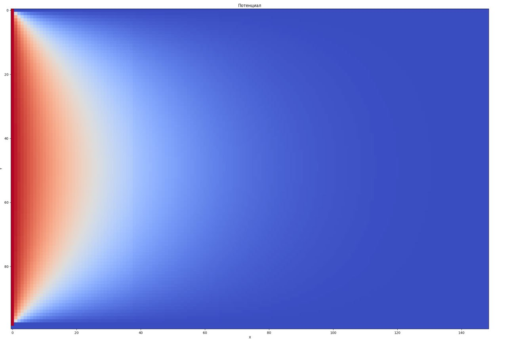

# Lamp Of God

physics vacum tube simulation

## Pictures

## How to run

Cloning repo

    git clone https://github.com/iv4n-t3a/lamp-of-god
    cd lamp-of-god

Building

    cmake -B build -S .
    make -C build

Running

    ./build/bin/main

Viewing cvc plot

    python3 utils/cvc.py cvc

Viewing potentials heatmap

    python3 utils/heatmap.py potentials
